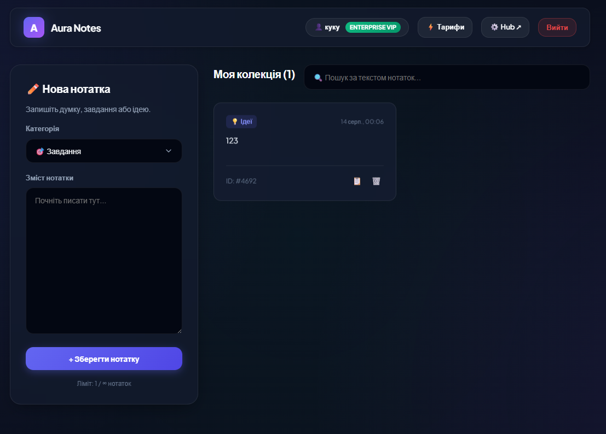

# ⚡ Aura Notes — Distributed Microservices SaaS Platform

> Сучасна повнофункціональна **SaaS-платформа для управління нотатками та підписками**, побудована на розподіленій мікросервісній архітектурі (**Node.js**, **Express**, **SQLite**) з інтерактивним пультом управління (**Microservices Control Hub**) та преміальним **Glassmorphism UI**.

[](https://github.com/Lutvunenko-Dmutro/Regv1/actions)
[](https://nodejs.org/)
[](https://expressjs.com/)
[](https://www.sqlite.org/)
[](#)

---

## 📸 Інтерфейс додатку



---

## 🏛️ Архітектура мікросервісів

Платформа розділена на незалежні мікросервіси, кожен з яких відповідає за свою бізнес-логіку:

```
                  ┌─────────────────────────────────────┐
                  │   📱 Modern Web UI (Glassmorphism)  │
                  │   (Login / Register / Notes / Subs) │
                  └──────────────────┬──────────────────┘
                                     │
           ┌─────────────────────────┼─────────────────────────┐
           ▼                         ▼                         ▼
┌─────────────────────┐   ┌─────────────────────┐   ┌─────────────────────┐
│  🔐 Auth Service    │   │  👤 Users Service   │   │  💳 Subscriptions   │
│     (Port 3002)     │   │     (Port 3000)     │   │     (Port 3001)     │
│                     │   │                     │   │                     │
│  - /register        │   │  - /users           │   │  - /subscriptions   │
│  - /login           │   │  - /users/:username │   │  - /subscriptions/:u│
│  - /health          │   │  - /health          │   │  - /health          │
└──────────┬──────────┘   └──────────┬──────────┘   └──────────┬──────────┘
           │                         │                         │
           └─────────────────────────┼─────────────────────────┘
                                     ▼
                        ┌────────────────────────┐
                        │   🗄️ SQLite Database   │
                        │      (users.db)        │
                        └────────────────────────┘
```

---

## ✨ Основні можливості

### 1. 🎛️ Інтерактивний пульт керування (`Microservices Example/microservices.html`)
- **Live Health Monitoring:** Моніторинг доступності всіх 3-х сервісів у реальному часі (зелені/червоні пінг-індикатори 🟢).
- **Interactive API Explorer:** Форми для тестування будь-яких запитів (реєстрація, логін, пошук профілю, оформлення підписки).
- **Live Response Console:** Переглядач відповідей з підсвіткою JSON, кодами статусу (200, 201, 401) та таймером затримки (latency ms).

### 2. 📝 Преміальний веб-додаток нотаток (`html/`)
- **Розумний блокнот (`notes.html`):** Створення нотаток з категоріями (💡 Ідеї, 💼 Робота, 🎯 Завдання, 🌟 Особисте), швидкий пошук, копіювання в буфер в 1 клік, видалення та таймстемпи.
- **Тарифні ліміти:** Динамічні обмеження кількості нотаток (Free — 5 нотаток, Pro — 50 нотаток, VIP — необмежено).
- **Тарифні плани (`subscriptions.html`):** 3-рівнева система підписок з миттєвою синхронізацією з бекендом.

---

## ⚡ Швидкий старт

### 1. Клонування репозиторію
```bash
git clone https://github.com/Lutvunenko-Dmutro/Regv1.git
cd Regv1
```

### 2. Встановлення залежностей та запуск мікросервісів
```bash
cd "Microservices Example"
npm install
npm start
```
> Команда `npm start` одночасно запустить усі 3 мікросервіси (порти 3000, 3001, 3002).

### 3. Відкриття в браузері
- **Інтерактивний Hub мікросервісів:** Відкрийте `Microservices Example/microservices.html`
- **Веб-додаток нотаток:** Відкрийте `html/index.html`

---

## 🔌 API Ендпоінти

| Сервіс | Порт | Метод | URL | Опис |
|---|---|---|---|---|
| **Auth** | `:3002` | `POST` | `/register` | Реєстрація нового користувача |
| **Auth** | `:3002` | `POST` | `/login` | Вхід користувача та генерація токена |
| **Auth** | `:3002` | `GET` | `/health` | Перевірка стану Auth сервісу |
| **Users** | `:3000` | `GET` | `/users` | Список усіх зареєстрованих профілів |
| **Users** | `:3000` | `GET` | `/users/:username` | Отримати профіль за логіном |
| **Users** | `:3000` | `GET` | `/health` | Перевірка стану Users сервісу |
| **Subscriptions** | `:3001` | `POST` | `/subscriptions` | Оформити або оновити тарифний план |
| **Subscriptions** | `:3001` | `GET` | `/subscriptions/:username` | Отримати активні підписки користувача |
| **Subscriptions** | `:3001` | `GET` | `/health` | Перевірка стану Subscriptions сервісу |

---

## 📁 Структура проєкту

```
Regv1/
├── .github/workflows/
│   └── ci.yml                     # GitHub Actions CI/CD пайплайн
├── Microservices Example/
│   ├── auth-service.js            # Auth мікросервіс (порт 3002)
│   ├── users-service.js           # Users мікросервіс (порт 3000)
│   ├── subscriptions-service.js   # Subscriptions мікросервіс (порт 3001)
│   ├── start-all.js               # Запуск усього кластера мікросервісів
│   ├── microservices.html         # Інтерактивний пульт керування та API Explorer
│   └── package.json               # Залежності (Express, SQLite3, CORS)
├── css/
│   └── Styles.css                 # Преміальна Glassmorphism дизайн-система
├── html/
│   ├── index.html                 # Екран входу
│   ├── register.html              # Екран реєстрації
│   ├── notes.html                 # Робочий простір блокнота
│   └── subscriptions.html         # Сторінка вибору тарифних планів
├── js/
│   ├── login.js                   # Логіка входу з API інтеграцією
│   ├── register.js                # Логіка реєстрації
│   ├── notes.js                   # Логіка нотаток, пошуку та лімітів
│   └── subscriptions.js           # Логіка активації тарифів
├── .gitignore                     # Виключення node_modules та SQLite DB
└── README.md                      # Документація проєкту
```

---

## 👨‍💻 Автор
* **Литвиненко Дмитро** — [@Lutvunenko-Dmutro](https://github.com/Lutvunenko-Dmutro)